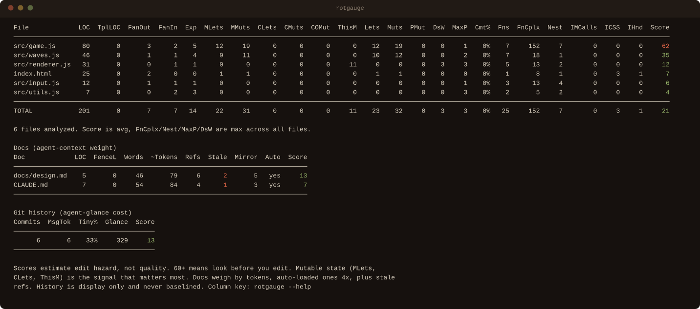
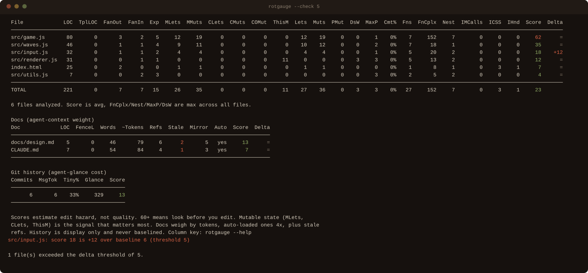
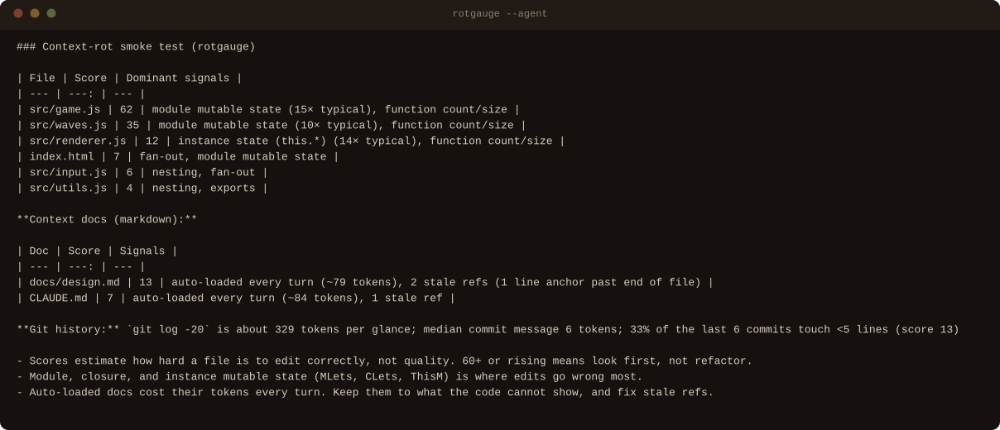

# rotgauge

**A context-rot smoke test for AI-assisted codebases.**

rotgauge scores how hard each file is for an AI (or anyone) to edit correctly. Not how "good" the code is. It's deliberately cheap: one pass, one dependency (Babel's parser), no API calls. Run it constantly, the way you'd glance at a gauge. A high or rising score means *look here before it collapses your context*, not *refactor now*.

The name: context rot builds up quietly until an edit goes wrong. This is the buildup meter.

```
npm install -g rotgauge   # or: npx rotgauge, bunx rotgauge
rotgauge                  # scan the current directory
rotgauge src/ app.html    # or specific files and directories
```

Runs on Node 20+ or [Bun](https://bun.sh). Built for JavaScript and TypeScript, plus inline scripts in HTML. The docs and git history gauges don't care about language, so a Python or Go repo still gets the CLAUDE.md weight, stale-ref, and history checks.



Scores are green under 40, yellow from 40, red from 60. Red means look here first.

## Usage

```
rotgauge [paths...] [flags]

--json             JSON output
--agent            Markdown summary for pasting into agent context (CLAUDE.md etc.)
--no-docs          Skip markdown docs
--no-history       Skip git history
--save-baseline    Write .rotgauge-baseline.json with current scores
--check [n]        Exit 1 if any file's score rose more than n over baseline (default 0)
--exempt <globs>   Comma-separated globs --check skips (still scored, no baseline entry)
--quiet            No tables, only --check results
```

`rotgauge --help` explains every column.

### As a CI gate

```sh
rotgauge --save-baseline    # once, then commit the file
rotgauge --check 5          # in CI: fail if any file rots more than +5
```

A failing check names the file and the delta, then exits 1:



### For your agent

`--agent` prints the worst files with the reason each one scored, plus three lines of guidance. Drop it into a CLAUDE.md or a system prompt:



## Exempting files from the gate

Generated files (schema bindings, `*.generated.ts`) score on schema size, not on anything you wrote, and no extraction can shrink them. Exempt them. They still show up scored in every report, but `--check` never counts them and `--save-baseline` writes them no entry. A `--check` run still names every exempt file that would have failed, so nothing slips through silently.

```sh
rotgauge --check 15 --exempt "module_bindings/**,*.generated.ts"
```

Long lists go in a `.rotgauge.json` next to the baseline. The flag and the file are unioned, and an unknown key is an error rather than a typo that quietly gates nothing:

```json
{ "exempt": ["module_bindings/**", "*.generated.ts"] }
```

Globs: `*` matches within one path segment, `**` across segments, `?` one character. A pattern matches at any depth, so `module_bindings/**` catches every bindings directory in a monorepo. Start it with `/` to anchor it to the working directory.

## Skipping directories

rotgauge never descends into dependency, build, or test directories (`node_modules`, `vendor`, `dist`, `build`, `out`, `coverage`, `public`, `test`, `tests`, `__tests__`, and test-report folders), or into dot-directories. Add your own names in `.rotgauge.json`. They match at any depth, on top of the built-in list:

```json
{ "skip": ["archive", "legacy"] }
```

Naming a skipped directory on the command line still scans it (`rotgauge test/`).

## What it measures

Scans `.js .jsx .ts .tsx .mjs .cjs .mts .cts .html` (inline scripts, styles, and handlers in HTML), plus `.md` docs (below). Code analysis runs on the AST of the file as written. TypeScript is parsed directly, types included, so nothing is transpiled and every number describes the source you actually edit.

| Column | Meaning |
| --- | --- |
| LOC | Non-blank, non-comment source lines |
| TplLOC | Lines inside big template literals. Discounted from size: data, not logic |
| FanOut / FanIn | Local imports out, type-only ones included / other scanned files importing this one |
| Exp | Exports, including exported types, interfaces, and enums |
| MLets / MMuts | Module-scope mutable bindings (`let`/`var`, including destructured) and mutations of them |
| CLets / CMuts | Closure state: mutable bindings declared in big (100+ line) functions. Behaves like module state |
| COMut | Mutations of module-scope `const` objects (`scene.background = ...`) |
| ThisM | `this.*` mutations. Class instance state |
| Lets / Muts | All mutable bindings / mutations |
| PMut | Parameter property mutations (`state.foo = bar` where `state` is a param) |
| DsW / MaxP | Widest destructure / most parameters. Wide interfaces |
| Fns / FnCplx / Nest | Function count / worst function (length x nesting) / deepest control nesting |
| IMCalls | Method calls on imported bindings (display only) |
| ICSS / IHnd | Inline CSS lines / inline event handlers (HTML) |

**Score** blends all of that, scaled so 60 means "would benefit from extraction." Shared mutable state carries the heaviest weights. It's the strongest predictor of an AI making a wrong edit, whether it lives at module scope (MLets), trapped in a giant closure (CLets), or on a class instance (ThisM).

It's a smoke detector, not a judge. The score underweights some real complexity (wide config-passing surfaces) and overweights some benign patterns. Use it to decide where to look.

Weights can change between minor versions. Re-run `--save-baseline` after upgrading so `--check` deltas stay meaningful.

## Docs rot too

Markdown files get their own table, on the same bands. Docs have no mutable state, but they weigh on agent context the same way tangled code does. The auto-loaded ones (CLAUDE.md, AGENTS.md, and anything they `@import`) charge their full token count on **every** turn. A bloated CLAUDE.md is context rot you pay for constantly.

| Column | Meaning |
| --- | --- |
| LOC / FenceL | Non-blank lines / lines inside fenced code blocks |
| Words / ~Tokens | Word count / estimated tokens (about 4 chars each) |
| Refs | Repo paths the doc cites, in backticks, links, or bare |
| Stale | Cited source paths that no longer exist, plus `file:line` anchors pointing past the end of a file. Both mislead agents |
| Mirror | Live source files the doc catalogs. Docs that restate the code go stale fastest |
| Auto | Loaded into agent context automatically every turn |

Doc score is token weight (auto-loaded counts 4x) plus staleness plus mirroring. Staleness is checked conservatively. Only source extensions count, so a reference to a gitignored `data/*.db` is never stale, and a loosely spelled path like a bare filename is resolved against the whole tree before anything is called stale.

`file:line` anchors rot quietly. A doc that says "the guard is at auth.ts line 412" passes every path check forever while the line drifts into unrelated code. Only an anchor past the end of the file is provably dead, so that's the only one counted. `--agent` also flags any doc leaning on three or more anchors. Cite symbol names instead.

Docs join the baseline, so `--check` catches a CLAUDE.md that quietly doubled. `--no-docs` turns all of this off.

## Git history rots too

Agents read history constantly: `git log` at session start, `git show` while orienting. Verbose AI-written commit messages and swarms of tiny commits tax every one of those reads. Inside a git repo, rotgauge prints one repo-level row:

| Column | Meaning |
| --- | --- |
| Commits | Recent non-merge commits analyzed (up to 100) |
| MsgTok | Median commit message tokens |
| Tiny% | Commits changing fewer than 5 lines |
| Glance | Estimated tokens of `git log -20`, what one look at history costs |

This is a weight gauge, not commit-message linting. A detailed body on a gnarly migration is fine. A history where every commit carries one is not. These numbers move on every commit, so they stay out of the baseline and never trip `--check`. `--no-history` turns the row off.

## Development

```sh
bun test                    # unit and CLI tests
bun rotgauge.js --check 5   # rotgauge gates itself against the committed baseline
bun run screenshots         # rebuild the README images from a demo project
```

CI runs the first two, and repeats the self-check on Node. When a deliberate change moves a score, re-run `--save-baseline` and commit the result.

## License

MIT
